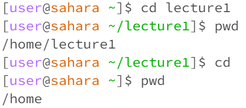
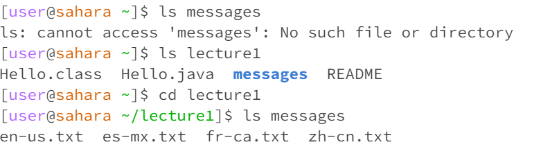
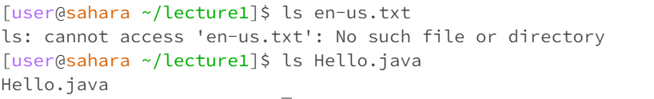
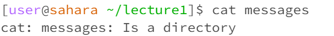
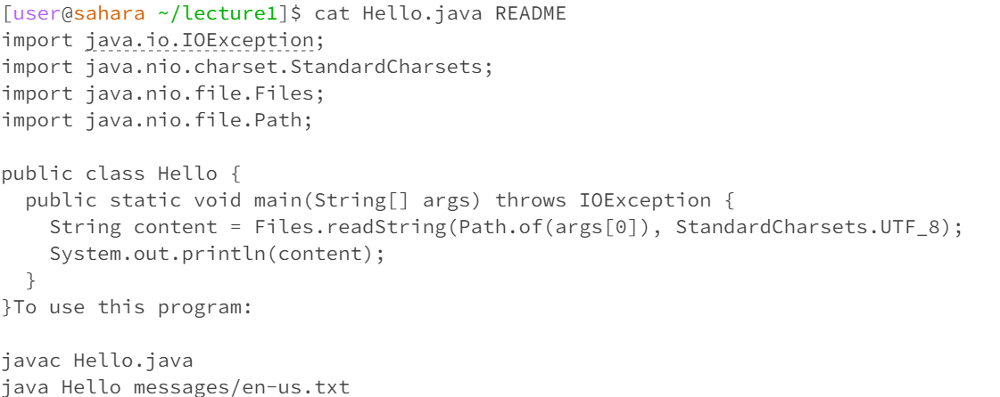

# Lab Report 1
*Jasmine Zhang A17371205*
## Command cd
**Question 01**

I started in lecture1 working directory, and tried the cd command with no arguments from there.
We would have no output for this command, and it is not an error.
If we type pwd, we would see that command cd with no argument would direct us back to the home directory.

**Question 02**

Wokring directory: home.
Here, the argument is lecture1, which is the name of a working directory.
We can see that cd command with a directory as argument would direct us to that specific directory. There is no output, and it is not an error.
With pwd command, we see that we are directed to lecture1 directory.

**Question 03**

Working directory: lecture1.
Here, the argument is Hello.java, which is a file name under working directory: lecture1.
In this case, the file can be found, but cd command cannot work with a file.
Thus, system would print "Not a directory", as an error message

In another scenario, the argument is zh-cn.txt, which is a file under message directory, not the working directory we are in right now (lecture1).
In this case, it cannot find the file, nor a directory, and it would print out "No such file or directory" as an error message.

In summary, the output would be an error, because cd command can only be used on directories, not on files.

## Command ls
**Question 01**

Taking in no argument, command ls would print out the names of all files and folders under the directory we are currently in.
When working directory is home, there is only one folder. It would print out the name of that folder: lecture1. When I change working directory to lecture1, there is one folder and three files. It would print out the name of the folder: messages, and the names of the three files: Hello.class, Hello.java, README. These outputs are not error.

**Question 02**

Taking in a directory as an argument, ls would print out names of files and folders in that directory only when the directory is accessible under current directory.
When working directory is home and argument is messages, it would print out an error output "No such file or directory" because messages in under lecture1 instead of home directory, and cannot be accessed. If working directory is home and argument is lecture1, command ls would correctly print out names of files and folders in lecture1, since lecture1 is under home directory and can be accessed.
When working directory is lecture1, taking in an argument of messages would print out files and folders in messages correctly with no error output, because the messages directory can now be accessed.

**Question 03**

Working directory is in lecture1, where the file Hello.java can be accessed.
Here, we take Hello.java as argument, command ls would simply print out the file name: Hello.java, since the argument is the file name itself, and ls would print out any file and folder names.
This is not an error output.

## Command cat
**Question 01**

Working directory is home.
Here, I try command cat with no arguments, it would return a workspace that would duplicate user's input. I typed "Hello, world", and it returns the same words. Use "Control + c" to get out of the loop.
There is no error message, command cat without arguments would give a wierd loop.

**Question 02**

Working directory is lecture1. 
Command cat would print out the content in a specific file, so when the argument is a directory (here, argument is messages), it would return an error messages saying that the argument "Is a directory". It would not be able to print out content in the directory.

**Question 03**

Working directory is lecture1. 
Here, I take two file names as argument: Hello.java and README. Both files are under the directory lecture1 that we are currently in. The cat command would print out content within these two files respectively, first print out Hello.java, then README. The output is not an error.
