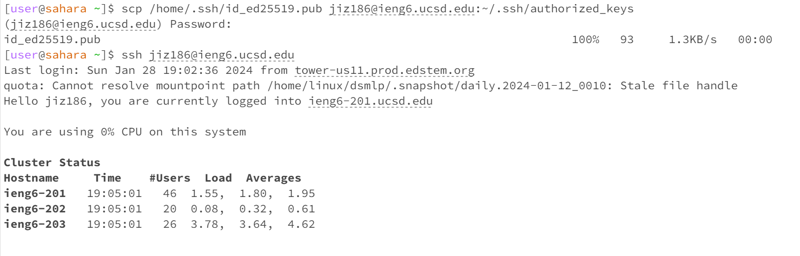

# Lab Report 2
*Jasmine Zhang A17371205*
## Part 1
ChatServer code
```
import java.io.IOException;
import java.net.URI;

// adds text message in the form <user>: <message>
class Handler implements URLHandler {

    //create new string outside method
    //otherwise it would be renewed everytime we run the method
    String storeString = "";
    public String handleRequest(URI url){
        if (url.getPath().equals("/")){
            return storeString;
        } else{
            if (url.getPath().contains("/add-message")){
                //get url after ? and split by &
                //store in input String array
                String[] input = url.getQuery().split("&");
                //split the two strings seperately
                //store in message and user String array
                String[] message = input[0].split("=");
                String[] user = input[1].split("=");
                //Strings we need are stored in user[1] and message[1]
                String result = String.format(user[1] + ": " + message[1] + "\n");
                
                //store result in String
                //return string
                storeString += result;
                return storeString;
            }
        }
        return "404 not found!";
    }
}

class ChatServer {
    public static void main(String[] args) throws IOException {
        if (args.length ==0){
            System.out.println("Missing port number. Please try again.");
            return;
        }
        //get port number and typecast into integer
        int portNum = Integer.parseInt(args[0]);
        //start server
        Server.start(portNum, new Handler());
    }
}
```

Screenshot 1


Screenshot 2


## Part 2
Absolute path to private key


Absolute path to public key


Terminal interaction without password



Here, once I've stored my public ssh key within the .ssh directory on my remote account, I was asked to enter my password. When I try to log in after this, I was able to log in directly, without being asked for a password.


## Part 3
In week 2 lab, I've learnt that I can connect my laptop to another computer by using the command *ssh user@ieng6.ucsd.edu*, which I did not know before. By using this command and typing in my student account password upon log in, I was able to connect my laptop to a computer in CSE basement that would act as a server to run any commands that I run on my own laptop. 

I've also learnt that we can write codes to create a webpage, and we can access certain paths and codes with the url bar on our browser. By changing the url and entering certain commands encoded in the code block, we would be able to run the program accordingly and edit the webpage itself.
