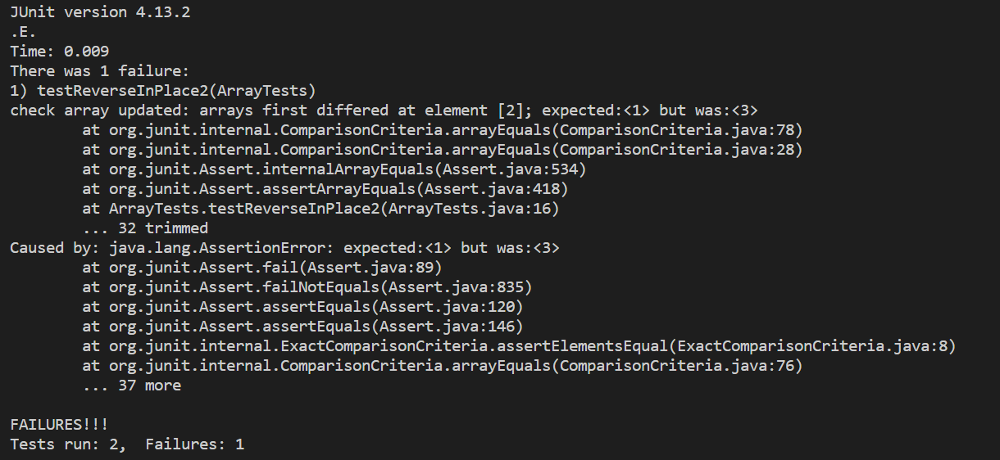

# Lab Report 03
*Jasmine Zhang A17371205*

## Part 01 - Bugs

**Bug to analyze**

Here, I choose to work on the bugs in `ArrayExamples.java`, specifically, the bugs in method `reverseInPlace(int[] arr)`.

**Failure-inducing input**

```
@Test
public void testReverseInPlace2(){
   int[] threeElements = {1, 2, 3};
   ArrayExamples.reverseInPlace(threeElements);
   assertArrayEquals("check array updated", new int[]{3, 2, 1}, threeElements);
}
```

**Input does not induce failure**

```
@Test 
public void testReverseInPlace() {
   int[] oneElement = {1};
   ArrayExamples.reverseInPlace(oneElement);
   assertArrayEquals("check array updated", new int[]{1}, oneElement);
}
```

**Symptoms with screenshots**



From the screenshot above, we can see that two tests ran, with 1 failure. The succeeded test method is `testReverInPlace()`. The failure test method is `testReverseInPlace2()`. The value of the actual array at index 2 (which is 1) is different than the expected value (which is supposed to be 1). From this error message, we know that one of our test cases failed, and there is a wrong implementation in our method. Specifically, we did not return the correct array in reversed order.


**Bug with before-and-after code**

**Before**

```
static void reverseInPlace(int[] arr) {
    for(int i = 0; i < arr.length; i += 1) {
      arr[i] = arr[arr.length - i - 1];
    }
  }
```

**After**

```
  // Changes the input array to be in reversed order
  static void reverseInPlace(int[] arr) {
    //store original array
    int[] newArr = new int[arr.length];
    //copy arr to newArr
    for(int i = 0; i < arr.length; ++i){
      newArr[i] = arr[i];
    }
    //change input array to reversed order
    for(int i = 0; i < arr.length; i += 1) {
      arr[i] = newArr[newArr.length - i - 1];
    }
  }
```

The bug of this method is that it did not copy the original array over as a new array before entering the for loop to assign reversed value to the original array. In this situation, assigning elements from end of the array to start would alter elements in start of `arr`, thus when it comes to assigning from start to end, we would be assigning elements that has been overwritten already. We need to store the elements in `arr` so that elements in the array would not change as we assign elements from end to start to reverse the order.

To fix the bug, we can create a new array `newArr` and use a for loop to copy elements in `arr` to `newArr`. Now that every element is stored in `newArr`, we can write a for loop to assign the last element in `newArr` to first in `arr`, second last in `newArr` to second in `arr`, etc. In this way, we are assigning the correct elements from end to start, since elements in `newArr` are copied from `arr` and will not be changed as we alter the `arr` array itself. As a result, we would changed the input array to be its reversed order correctly by fixing the code.

## Part 02 - Researching Commands

**Interesting command line options**

For this part, I decide to research more interesting command line options on the command `find`.

**Option 1**


**Two examples on each option**


**Source citation**
