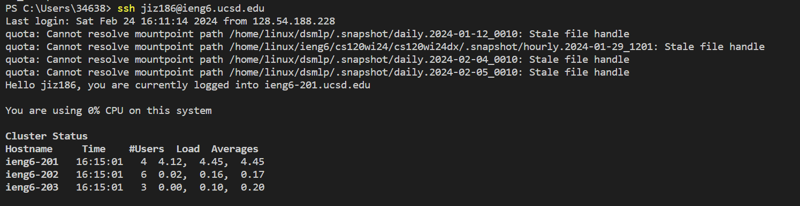
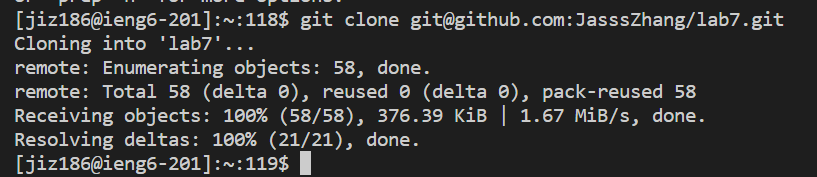
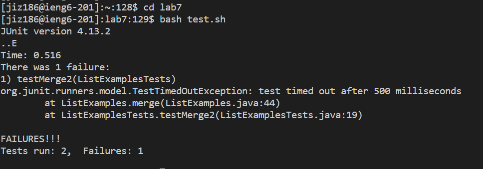
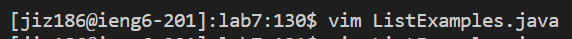
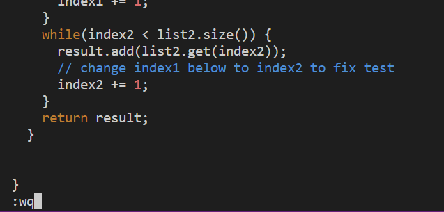
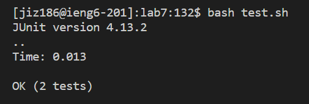
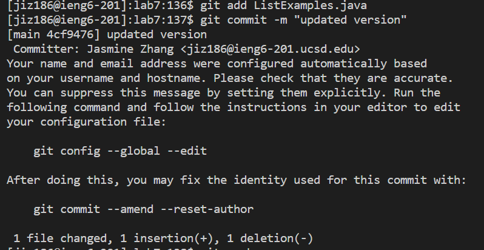
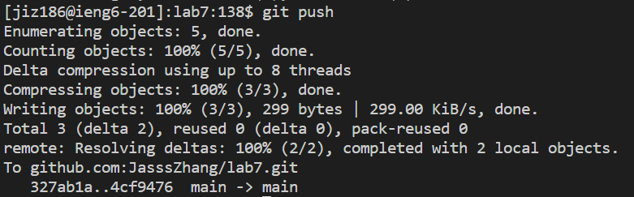

# Lab 4
*Jasmine Zhang A17371205*

## Step 4: log into ieng6

Key pressed: `ssh jiz186@ieng6.ucsd.edu` `<enter>`.

Here, I logged into my ieng6 account by typing in the command `ssh jiz186@ieng6.ucsd.edu`, and then pressed `<enter>`. I was able to log in without password because I stored the public key in `authorized_keys` in advance to save time from logging in.

## Step 5: Clone fork repository from Github

Key pressed: `Ctrl` `c` `git clone ` `Ctrl` `v` `<enter>`

Here, I forked `lab7` repository in my Github account in advance, and pressed `Ctrl-c` to copy the `SSH` URL(`git@github.com:JasssZhang/lab7.git`) onto clipboard. Then I typed `git clone ` onto the terminal and pressed `Ctrl-v` (or with a right click on the mouse) to paste the URL from the clipboard. Finally, I pressed `<enter>` to run the command, we can see that the repository is successfully cloned to my ieng6 account.

## Step 6: Run tests (fails)

Key pressed: `cd lab7` `<enter>`, `bash test.sh` `<enter>`

Here, I first typed `cd lab7` and pressed `<enter>` to make sure that I am currently in `lab7` directory. Then, I accessed the bash script `test.sh` with run commands in it by typing in `bash test.sh` and `<enter>`. Two tests ran with 1 failure, as demonstrated in terminal output. 

## Step 7: Edit code fix failed tests

Key pressed: `vim ListExamples.java`, `43j` `11l` `x` `i` `2` `<esc>` `:wq` `<enter>`

Here, I used `vim` command to edit the file. In the terminal, I typed in `vim ListExamples.java` to access the java file `ListExamples`. My cursor is at the top front of the file's output, so I typed `43j' to move the cursor down 43 lines. Then, I typed `11l` to get to the place that needs edit. Then, I typed in `x`, `i`, `2`, `<esc>`, `:wq`, `<enter>`. `x` deleted the character under my current cursor, `i` placed me into insert mode, `2` added the character 2 after "index", `<esc>` get me back to normal mode, `:wq` saves my edit and exit `vim` command back to the terminal. Here, I have successfully editted and saved my code.

## Step 8: Run tests (succeeds)

Key pressed: `<up>` `<up>` `<enter>`.

Here, the `bash test.sh` command was 2 up in the search history, so I pressed `<up>` two times to access it and `<enter>`. The bash script with commands to run the test was ran, and we can see from the output that two tests ran and all passed.

## Step 9: Commit and push change to Github

Key pressed: `git add ListExamples.java` `<enter>`, `git commit -m "updated version"` `<enter>`, `git push` `<enter>`

Here, I used `git add` command with the file name `ListExamples.java` to add the change I've made in the file. Then, I used `git commit` to commit changes to Github. `-m "updated version"` allow me to add the commit message in the command line as `"updated version"`. Lastly, I used `git push` command to push the committed change to main. 
