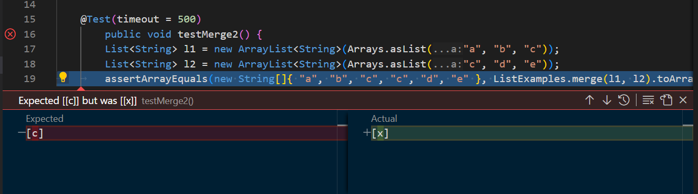
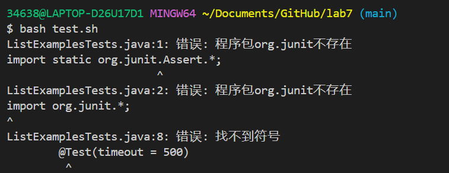
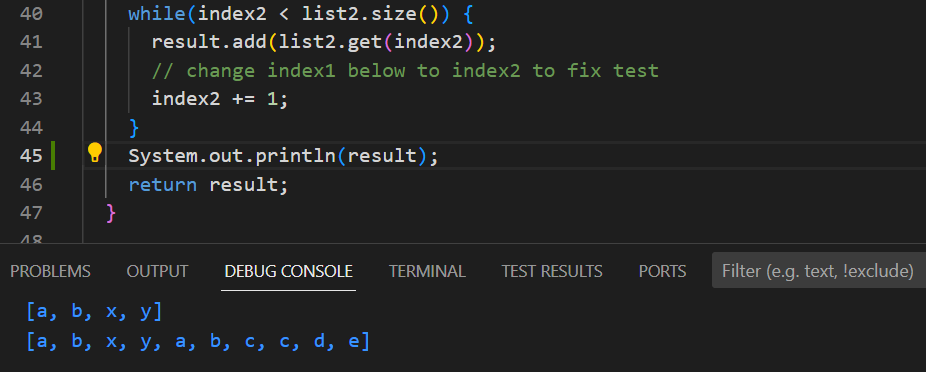

# Lab 5
*Jasmine Zhang A17371205*

## Part 1 – Debugging Scenario
**Original Student Post of Bug**

Hi, I am having difficulty for passing the tests in lab7. I have correctly changed line 15 to `result.add(s)`, and line 44 to `index2`, but the second merge test failed. Is it anything I did that caused the error, or are there other bugs in the program that I did not notice? 

Also, when I'm trying to run the bash script to test the program, it's giving me strange error message in the terminal saying things like `org.junit` does not exist, or `@Test` symbol is not found, etc. I double checked that I did not changed the bash script given in the cloned repository, also JUnit is correctly installed and imported. I wonder what might be the issue there. Thank you so much for your time!

**TA's Response**

Hi, your error message said expected `[c]` but was `[x]`. `[x]` appeared in only the first test method `testMerge1()`. When these two test cases are mixed together in some way in the output, it might be that you did not store the `result` value everytime individually for each `merge` call. We need more information about your code to help you find out what is going on, but that is definitely something you can check and edit. 

You can try jdb and stopping at line 48 or something,and check `locals` or `print reults`. Look at the output carefully and see what you can find. Or, you can try `System.out.println()` in some parts in the `merge` method to trace to value in `result`. Please provide further screenshot of your actual code in `ListExamples.java` if the bug is still there.

For the bash script, can you sreenshot what you currently have? It might be that Windows and Mac have different run commands for JUnit. I think the provided code is for Mac users specifically, so if your are using Windows, be sure to change it accordingly. You can find the corresponding run commands in Week4 lab. I hope this answers your question. Please follow up if you have more questions. Thank you!

**Student's Output and Bug Description**

Student: I got the array output of the two test cases as shown in screenshot below after putting `System.out.println(result)` before the return statement in `Merge` method. This demonstrated that some parts of the `result` is indeed not updated, and the expected array list for `testMerge2()` is simply appended after the original elements in `result`.

This shows that the bug is that there is something wrong with the `result` variable. They are made to be instance variables instead of local variables in each method. This is why the result from the first test case is stored and result from the second one is added based on the previous result. 

**Additional Information**

1. File & directory

   I designed this bug from `https://github.com/ucsd-cse15l-s23/lab7` in Week7's lab activity. File used are `ListExamples.java`, `ListExamplesTests.java`, and `test.sh`. Directory is `lab7`.

2. Before fixing the bug

   Edits I made to design the bug in `ListExamples`:

   Line 15: change `result.add(0, s)` to `result.add(s);`

   For both `filter` and `merge` method, delete line `List<String> result = new ArrayList<>();`

   Add `static List<String> result = new ArrayList<>();` as an instance variable of the class `ListExamples`

3. Triggering the bug

   Manually run the test using VScode options, we can see thet `testMerge2()` failed, with error message.

   Open `git bash` terminal. Type `test.sh` in the terminal. We get the error message that `org.junit` is not found.

4. Fix the bug

   In `ListExamples.java`:
   Delete `static List<String> result = new ArrayList<>()` and add a local variable `result` in both `filter` and `merge` method respectively as `List<String> result = new ArrayList<>()`. In this way, the value of `result` would be stored individually and updated accordingly with each call of the method.

   In `test.sh`:
   Replace the original two lines of code with `javac -cp ".;lib/hamcrest-core-1.3.jar;lib/junit-4.13.2.jar" *.java`, and `java -cp ".;lib/junit-4.13.2.jar;lib/hamcrest-core-1.3.jar" org.junit.runner.JUnitCore ListExamplesTests`, so that the bash script can run in Windows.

## Part 2 – Reflection
One thing I learnt from lab in this second half of quarter is the Java Debugger(jdb) in Week8. I find it cool and useful as it allows users to test the program, edit from the command line, and find potential bugs in the program. Once we type in the compile and run command of jdb, we can enter a "debugging shell" in the terminal that allows us to freely enter commands to design our own specific debugging program. Here, `stop at` stops the program after certain line, `run` initializes jdb and gives us the output of tests. From those output information, we can deduce what is potentially going wrong in the program. What is more, we can further type in `locals` to get all values of current local values, or `print` to print out certain variable's value. These are commands that can give us further knowledge on the program and help us find the bug more efficiently.
